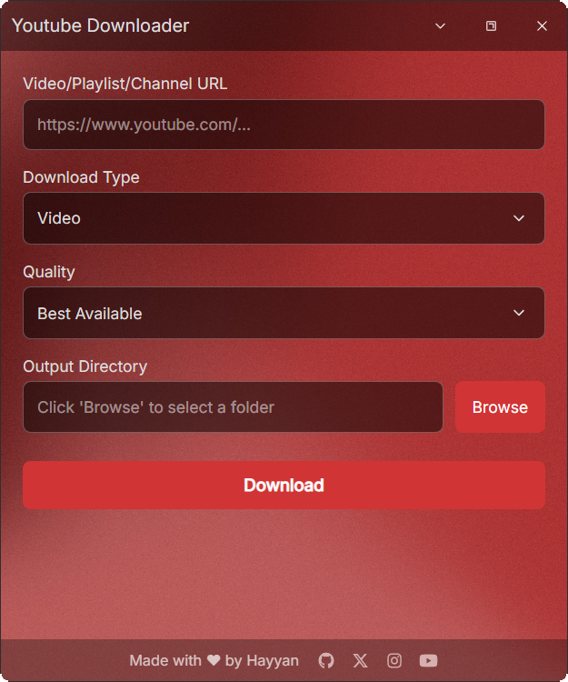

# Youtube Downloader

  

A modern desktop application for downloading videos, audio, and thumbnails from YouTube with a clean user interface.

  

## Features

- 🎥 **Video Downloads**
  - Multiple quality options from 240p to 4K
  - Best quality auto-selection
  - MP4 format support
  
- 🎵 **Audio Extraction**
  - High-quality MP3 conversion
  - Multiple audio quality options
  - Fast extraction process

- 🖼️ **Thumbnail Downloads**
  - Maximum resolution options
  - Multiple thumbnail quality choices
  - Quick thumbnail saving

- 💫 **Additional Features**
  - Modern, clean user interface
  - Dark theme design
  - Auto-updates for both app and yt-dlp
  - Cookie management for private videos
  - Support for playlists and channels

## Installation

1. Download the latest release from the [Releases](https://github.com/Hayyan0/Youtube-Downloader/releases) page
2. Run the installer
3. Launch Youtube Downloader

## Support

Having issues? Please check out:
- [Create an issue](https://github.com/Hayyan0/Youtube-Downloader/issues)
- Contact me on [X/Twitter](https://x.com/hyn_slm)

## Credits

Made with ❤️ by [Hayyan](https://github.com/Hayyan0)

## License

ISC License